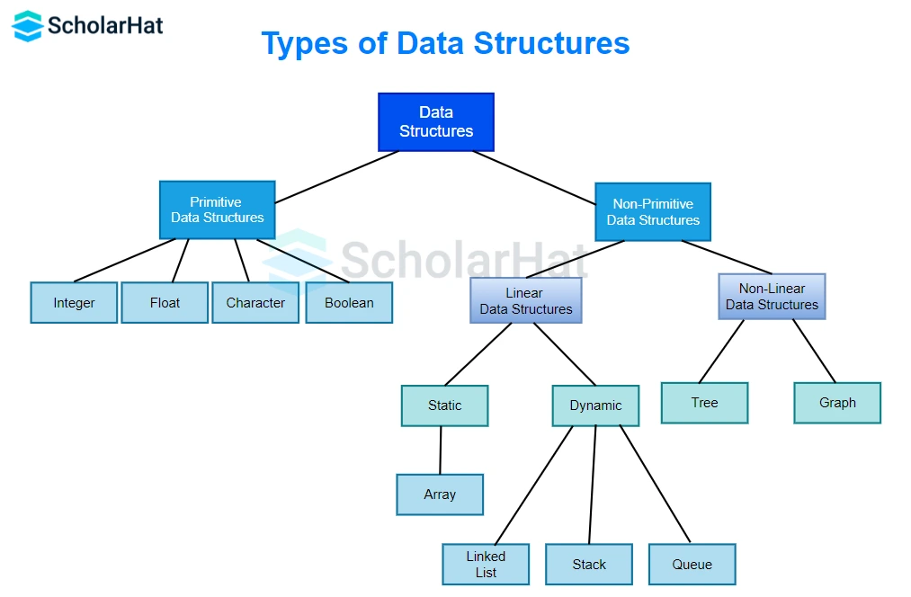
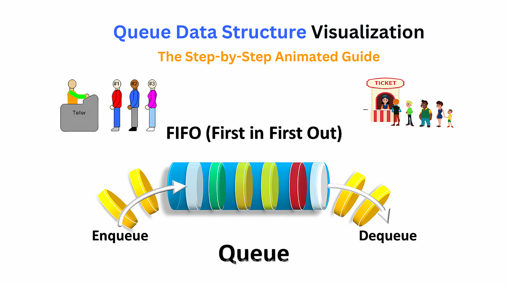

# DSA USING C

## What is Data Structure?

Data Structure is a branch of computer science, it is a concept which shows that how the data is to be stored inside the memory and what is the relation of the data with another data.

1. TREE
2. GRAPH
3. HASH TABLE
<!-- PRIMITIVE DATA TYPE: -->
4. INTERGER
5. FLOAT
6. CHAR
7. DOUBLE
8. BOOLEAN

## Q1. What is stack? \***\*\*\*\*\***\*\*\*\*\***\*\*\*\*\***

Stack is an order list in which elements are to be inserted/push and deleted/pop from one end called top end. And this follows LIFO.

### Examples:-

1. Memory allocation in c
2. Function execution
3. Recursion.
4. Menu-Driven application

### Operations on stack:

1. Push
2. Pop
3. Display

## What is queue? \***\*\*\*\*\*\*\***\*\*\*\*\***\*\*\*\*\*\*\***

Queue is an order list in which elements is to be inserted and deleted from two different end and it is FIFO list i.e,

1. Rear End - The end from element is to be inserted.
2. Front End - The end from element is to be deleted.

### operations on queue:h

1. Insert
2. Delete
3. Display

### Applications of Queue:

1. Operating System
2. Client-Server Application
3. Incoming Call In Mobile
4. Traffice Management
5. Printer Application
